# Web development-the blog
# Introduction
Web development is my 4th project I did with Code Institute. The requiremenrs for this project was to build a Full Stack site that required me to set up an authentication system that provide a role-based access to the site's data. Web development-the blog is a public community blog platform where users can interact with other users' posts. Authenticated users have more advantages as they can create and share their web development posts with other users.

# UX
## User stories
1. As a Site User I can view a list of blog posts so that I can select one to read
2. As a Site user I can view a paginated list of post so that I can select which post I want to view
3. As a Site User I can click on a blog post so that I can view the entire blog 
4. As a Site User / Admin I can view comments on an individual blog post so that I can read the conversation
5. As a Site User I can register an account so that I can my own posts
6. As a Site User I can leave comments on a post so that I can be involved in the conversation
7. As a Site User I can sign in and out of my account so that I can protect my account when I am not using it.
8. As a Site user I can login in my account and I can easily view and edit my profile
9. As a Site User I can add a post so that I can share my ideas with other users
10. As a Site user and author I can make changes to my own blog post so that I can update it
11. As a Site User and author I can delete my posts from the blog
12. As an Admin I can create, read, update and delete posts so that I can manage my blog content
13. As a Site User I can search for a blog post so that I can quickly identify the post I want

## Development planes
### site aims
The main aim for web development-the blog was to come out with a site where users can easily interact with the site, and other users as well. A community where one can easily create and share their own ideas as well as go through other people's ideas and share what they think through commenting. A platform where its easy for authors to  manage their own content through editing and deleting if they wish so.

### Target audience
1. Users
2.  Admin
3.  Demographic: Software developers or aspiring

The site allows users to :
- Register to set up their account
- Edit their profile
- Browse posts
- Create their own posts
- Edit and Delete their content
- Comment on posts

The site allows admin to :
- have full control of the site.

## Database schema

## Wireframes
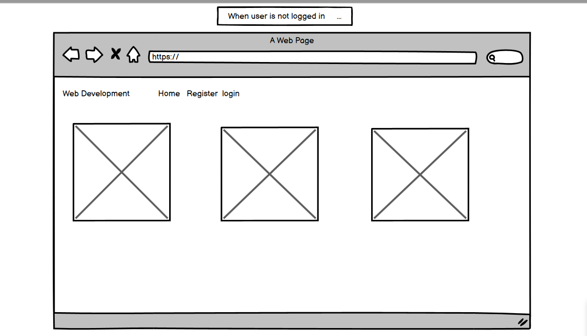

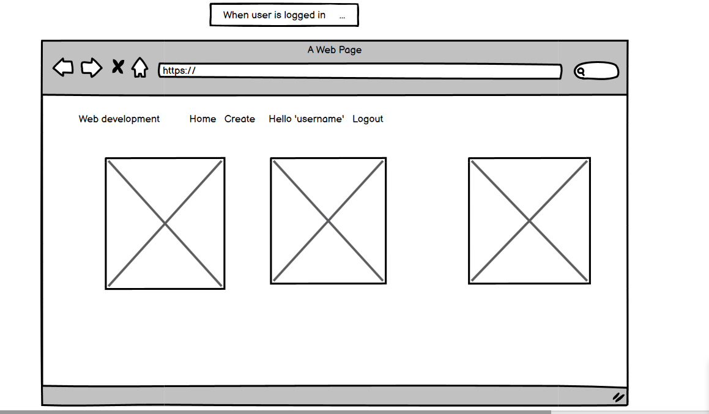

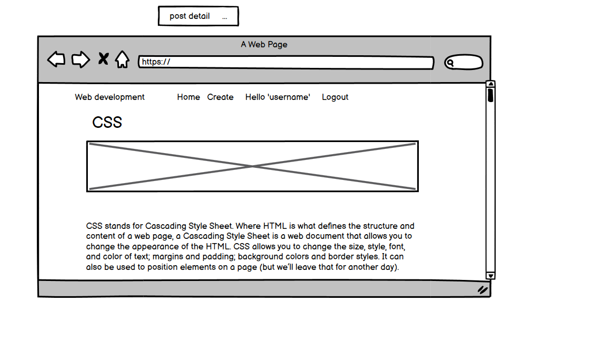

### Color scheme
 [Color hunt](https://colorhunt.co//) was used to select colors used for this project

## Features
### Landing page
- First time users sees the page below. 
- Navigation bar should users wish to access the site
- Paginated list of posts users can browse through and read whether authenticated or not
- The author of the post and time read for each post

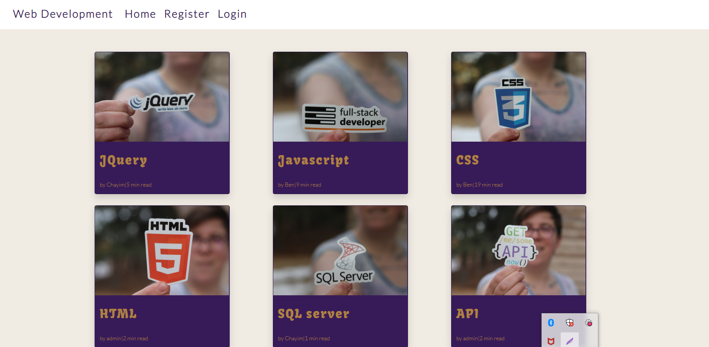 

### Post detail page
- When user clicks on particular post from the landing page, they are directed to the post where they can read the full post.
- navigation bar still appears at the top
- Post title appears at the top
- The author and the date the post was made also shows
- The image and the post detail follows

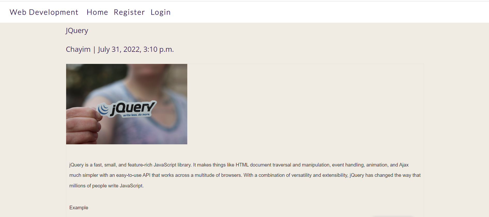
- comment section
- number of comments a particular post has
- author of the comment and date the comment as made
- However if the user is not signed in, they cannot share their thoughts through commenting. They are directed to login first
### Comments

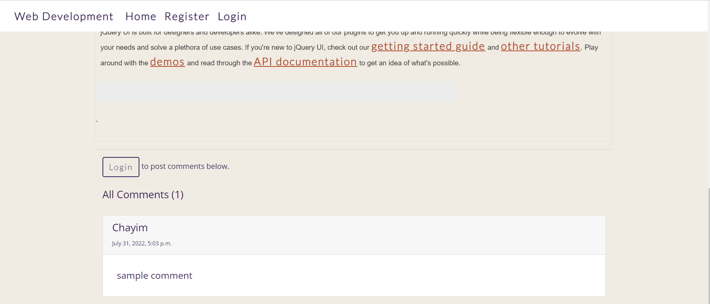

### Register

- Users that need more advantages with the site they will have to register an account first
- They need to register their username and password that need to be repeated to ensure it matches as well as the email which is optional.

- Existing users can just login with their username and password
#### register
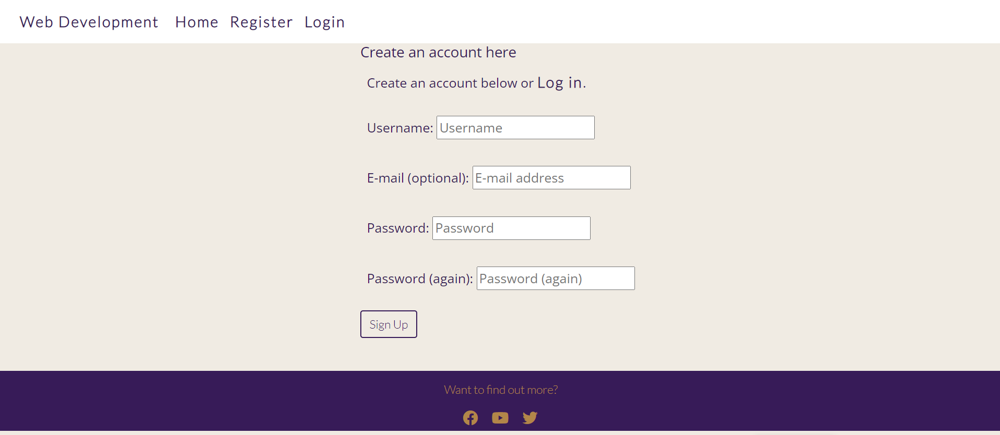

#### login
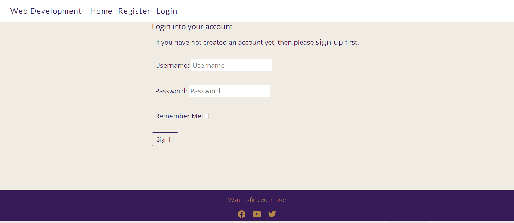

### Create
- When a user registers and is signed in, they can create their own posts and add comments.
- When signed the nav bar directs them on whatever they might wish to do.
- From this point they can change their username if they wish so by clicking profile on the navbar
- When creating a post, a user must add title, contents and image of the post, though they might forget a placeholder image will be added.

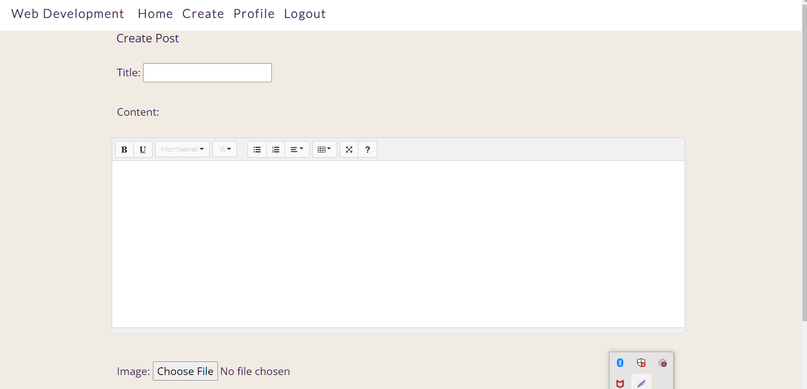

### Edit post
- Users have the ability to update their own posts
- This feature is only available to the signed in and author of that particular post
- They can edit the title as well as the post detail and replace image.

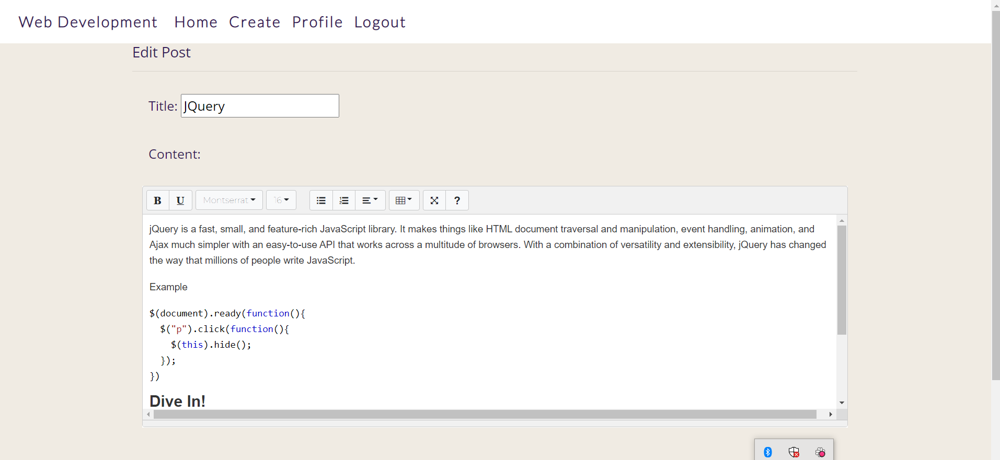

### Delete post
- Users have the ability to delete their own posts
- This feature is only available to the signed in and author of that particular post
- in case they clicked the delete button by mistake, they can easily cancel the process

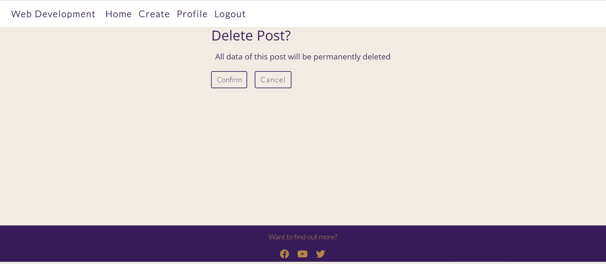

### Logout
- Finally users can protect their account by signing out when  they are done with the site
- in case they clicked the logout by mistake, they can easily cancel the process
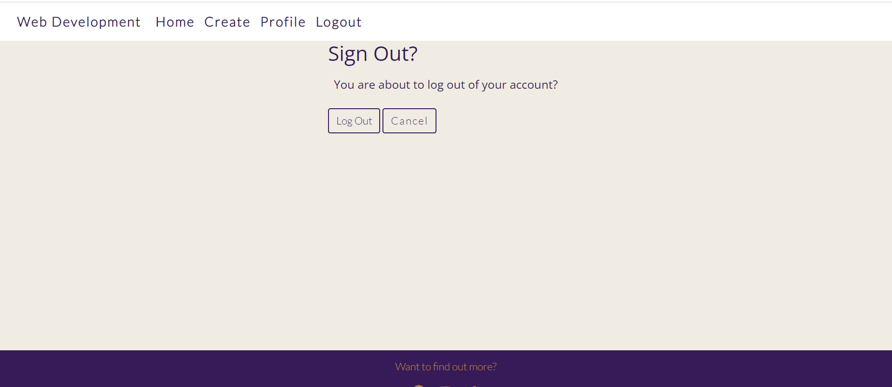

## Future features
- Ability for users to view author's profile. It was part of the original idea thats why the profile tab is on the navbar but could not finish to implement it in time
- ability for users to save their favourite posts
- users to delete their own comments
- users to reply to other comments
- users to login with their social media accounts

## Issues and bugs
I encountered quite a number of issues and bugs during the development of the site, however some deserves to be noted
- The first main issue I faced when I made my views, template and wired up the urls inorder to view the post detail, the page could not load and kept on getting no reverse match error. After wondering for hours on stack overflow I ended up contacting the tutor support. I needed to fix the link to the post with a primary key in the post detail page.
### Bugs
- Unable to customise summenote fields' width and toolbar. I found a useful post in pp4 slack channel, that state I had to add summernote config in my settings.py, and edit desired settings.
- I had used ckeditor as post editor as it was something very easy to understand. When I deployed the site to heroku, it could not load both on creat post and edit post page edit. Went through some few posts on stack overflow and realised I could not fix it as I feared some solutions would have made spend a lot of time. I had to revert back to summernote which I had been avoiding.
- When I used the readtime library, I forgot to add it to the requirements.txt. Tried to deploy the site to heroku weeks later and could not even interpret the errors on my logs but thanks to Sean from tutor support who picked it in less than 2minutes

## Technologies used
- [HTML](https://developer.mozilla.org/en-US/docs/Glossary/HTML5)
- [CSS](https://www.w3schools.com/css/)
- Python used to implement django functionality
## Frameworks and libraries
- [Django](https://www.djangoproject.com/) 
  - is the backbone of this project used to build models, forms and views of the site
- [Bootstrap](https://getbootstrap.com/docs/5.0/getting-started/introduction/)
  - used to implement the responsiveness of the site, using bootstrap classes.
- [Summernote](https://summernote.org/) 
  - used to allow users to add styling when creating posts for the site. 
- [Cloudinary](https://cloudinary.com/) 
  - used as free cloud storage for images uploaded to the site
- [readtime](https://stackoverflow.com/questions/43762694/how-to-add-post-content-reading-time-in-a-django-blog) 
  - used to calculate how long it takes to read the post
- [Google fonts](https://fonts.google.com/) 
  - used for the fonts used on the site
- [Git](https://git-scm.com/) 
  - used for version control

