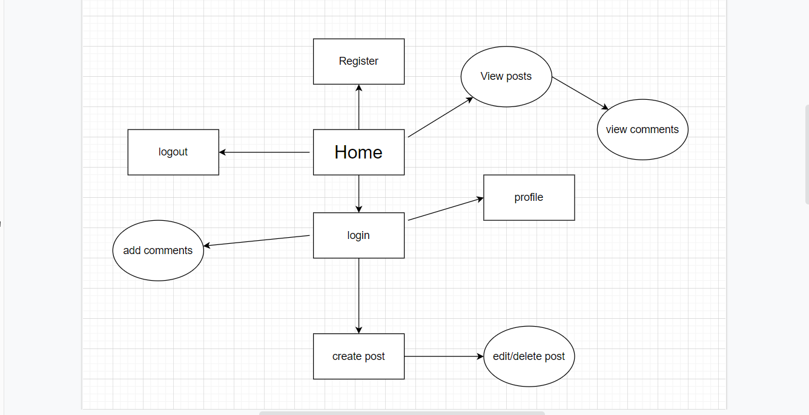
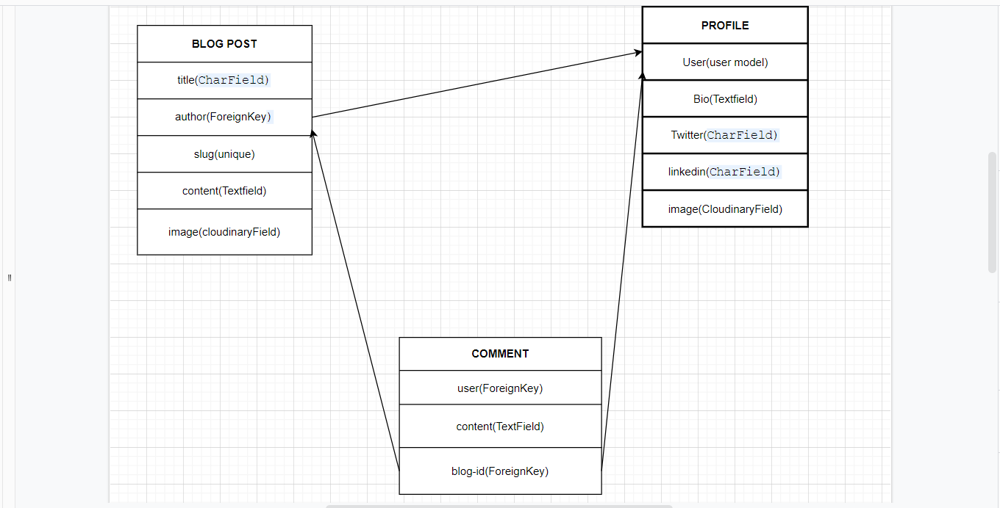
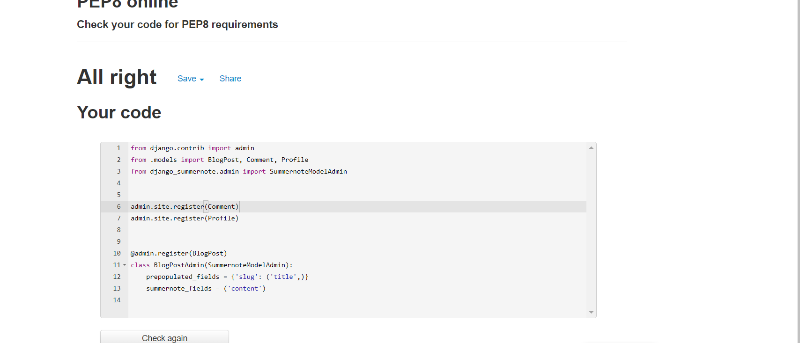
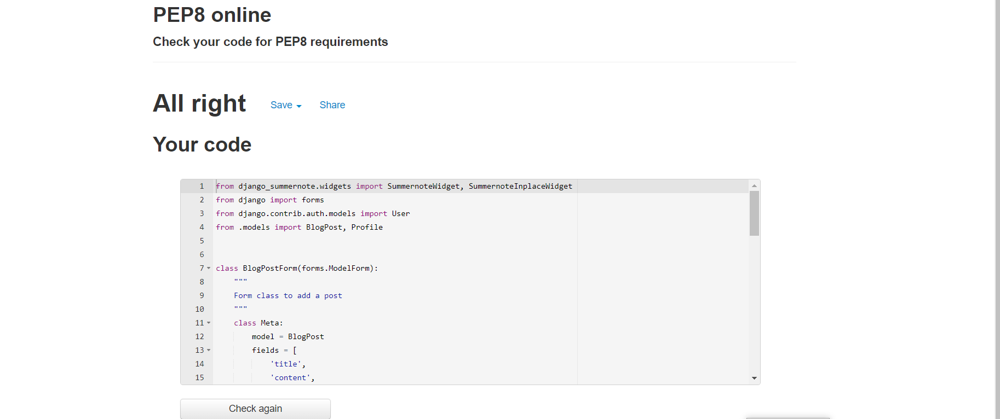
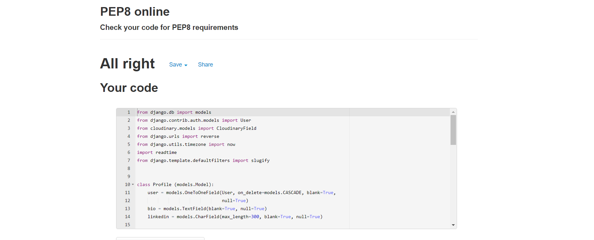
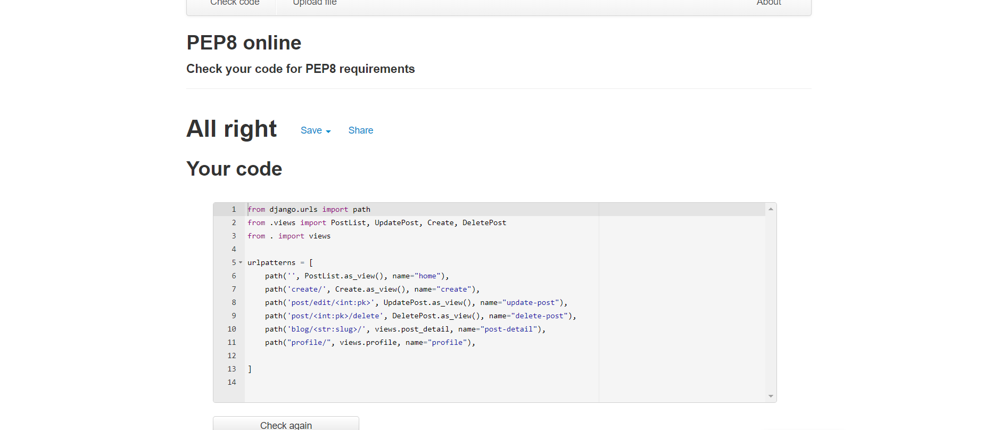
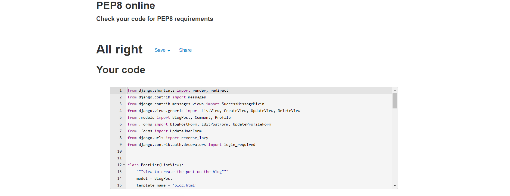
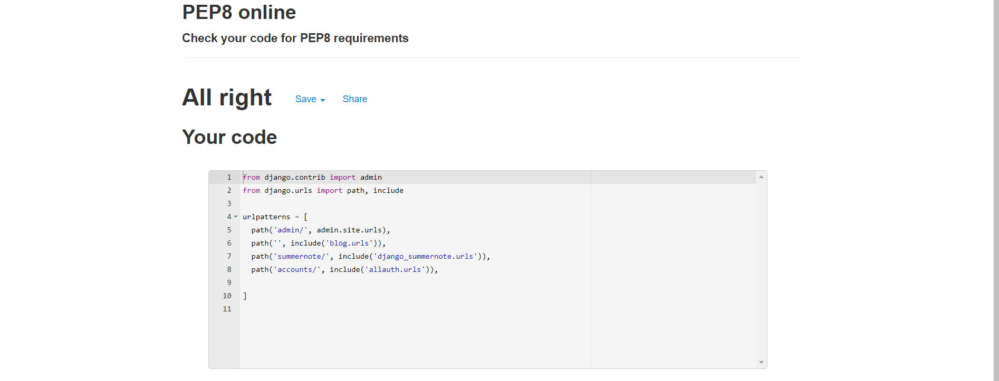

# Web development-the blog
# Introduction
Web development is my 4th project I did with Code Institute. The requiremenrs for this project was to build a Full Stack site that required me to set up an authentication system that provide a role-based access to the site's data. Web development-the blog is a public community blog platform where users can interact with other users' posts. Authenticated users have more advantages as they can create and share their web development posts with other users.

# UX
## User stories
1. As a Site User I can view a list of blog posts so that I can select one to read
2. As a Site user I can view a paginated list of post so that I can select which post I want to view
3. As a Site User I can click on a blog post so that I can view the entire blog 
4. As a Site User / Admin I can view comments on an individual blog post so that I can read the conversation
5. As a Site User I can register an account so that I can my own posts
6. As a Site User I can leave comments on a post so that I can be involved in the conversation
7. As a Site User I can sign in and out of my account so that I can protect my account when I am not using it.
8. As a Site user I can login in my account and I can easily view and edit my profile
9. As a Site User I can add a post so that I can share my ideas with other users
10. As a Site user and author I can make changes to my own blog post so that I can update it
11. As a Site User and author I can delete my posts from the blog
12. As an Admin I can create, read, update and delete posts so that I can manage my blog content
13. As a Site User I can search for a blog post so that I can quickly identify the post I want

## Development planes
### site aims
The main aim for web development-the blog was to come out with a site where users can easily interact with the site, and other users as well. A community where one can easily create and share their own ideas as well as go through other people's ideas and share what they think through commenting. A platform where its easy for authors to  manage their own content through editing and deleting if they wish so.

### Target audience
1. Users

2.  Admin

3.  Demographic: Software developers or aspiring

The site allows users to :
- Register to set up their account

- Edit their profile

- Browse posts

- Create their own posts

- Edit and Delete their content

- Comment on posts

The site allows admin to :
- have full control of the site.

## Structure
This is a simple chart I made to remind me of what I needed to put in place and what a user can do signed in or signed out

## Database schema

As per profile model, the original idea was to make users make their own profile that can be viewed by other users. I also later added extra fields to BlogPost and Comment models which are  created_on and dateTime respectively

## Wireframes

### Color scheme
 [Color hunt](https://colorhunt.co//) was used to select colors used for this project

## Features
### Landing page
- First time users sees the page below. 

- Navigation bar should users wish to access the site

- Paginated list of posts users can browse through and read whether authenticated or not

- The author of the post and time read for each post

 

### Post detail page
- When user clicks on particular post from the landing page, they are directed to the post where they can read the full post.

- navigation bar still appears at the top

- Post title appears at the top

- The author and the date the post was made also shows

- The image and the post detail follows

- comment section

- number of comments a particular post has

- author of the comment and date the comment as made

- However if the user is not signed in, they cannot share their thoughts through commenting. They are directed to login first
### Comments

### Register

- Users that need more advantages with the site they will have to register an account first

- They need to register their username and password that need to be repeated to ensure it matches as well as the email which is optional.

- Existing users can just login with their username and password

#### register

#### login

### Create
- When a user registers and is signed in, they can create their own posts and add comments.

- When signed the nav bar directs them on whatever they might wish to do.

- From this point they can change their username if they wish so by clicking profile on the navbar

- When creating a post, a user must add title, contents and image of the post, though they might forget a placeholder image will be added.

### Edit post

- Users have the ability to update their own posts

- This feature is only available to the signed in and author of that particular post

- They can edit the title as well as the post detail and replace image.

### Delete post
- Users have the ability to delete their own posts

- This feature is only available to the signed in and author of that particular post

- in case they clicked the delete button by mistake, they can easily cancel the process

### Logout

- Finally users can protect their account by signing out when  they are done with the site

- in case they clicked the logout by mistake, they can easily cancel the process

## Future features
- Ability for users to view author's profile. It was part of the original idea thats why the profile tab is on the navbar but could not finish to implement it in time

- ability for users to save their favourite posts

- users to delete their own comments

- users to reply to other comments

- users to login with their social media accounts

## Issues and bugs
I encountered quite a number of issues and bugs during the development of the site, however some deserves to be noted
- The first main issue I faced when I made my views, template and wired up the urls inorder to view the post detail, the page could not load and kept on getting no reverse match error. After wondering for hours on stack overflow I ended up contacting the tutor support. I needed to fix the link to the post with a primary key in the post detail page.

### Bugs
- Unable to customise summenote fields' width and toolbar. I found a useful post in pp4 slack channel, that state I had to add summernote config in my settings.py, and edit desired settings.

- I had used ckeditor as post editor as it was something very easy to understand. When I deployed the site to heroku, it could not load both on creat post and edit post page edit. Went through some few posts on stack overflow and realised I could not fix it as I feared some solutions would have made spend a lot of time. I had to revert back to summernote which I had been avoiding.

- When I used the readtime library, I forgot to add it to the requirements.txt. Tried to deploy the site to heroku weeks later and could not even interpret the errors on my logs but thanks to Sean from tutor support who picked it in less than 2minutes

## Technologies used

- [HTML](https://developer.mozilla.org/en-US/docs/Glossary/HTML5)
- [CSS](https://www.w3schools.com/css/)
- Python used to implement django functionality

## Frameworks and libraries
- [Django](https://www.djangoproject.com/) 
  - is the backbone of this project used to build models, forms and views of the site
- [Bootstrap](https://getbootstrap.com/docs/5.0/getting-started/introduction/)
  - used to implement the responsiveness of the site, using bootstrap classes.
- [Summernote](https://summernote.org/) 
  - used to allow users to add styling when creating posts for the site. 
- [Cloudinary](https://cloudinary.com/) 
  - used as free cloud storage for images uploaded to the site
- [readtime](https://stackoverflow.com/questions/43762694/how-to-add-post-content-reading-time-in-a-django-blog) 
  - used to calculate how long it takes to read the post
- [Google fonts](https://fonts.google.com/) 
  - used for the fonts used on the site
- [Git](https://git-scm.com/) 
  - used for version control

## Testing
#### User stories
1. As a Site User I can view a list of blog posts so that I can select one to read
- Posts are easily visible, each with their clear title and easy to pick which one to read
2. As a Site user I can view a paginated list of post so that I can select which post I want to view
- Posts are paginated in rows of 3 and maximum of 6 posts per page and the rest will be pushed to the next page
3. As a Site User I can click on a blog post so that I can view the entire blog 
- After clicking post title, users can view the entire blog post including the author and date the post as made. If they are signed in they are allowed to comment.
4. As a Site User / Admin I can view comments on an individual blog post so that I can read the conversation
- Both site users signed in or not and the admin can go through comments. easy for the admin if they want to manage the converation.
5. As a Site User I can register an account so that I can my own posts
- Site users can register their account from the nav bar by putting their username, password and optional email inorder to have more benefits around the site like commenting, creating, editing and deleting their own content
6. As a Site User I can leave comments on a post so that I can be involved in the conversation
- signed in users can easily add in comments on any post
7. As a Site User I can sign in and out of my account so that I can protect my account when I am not using it.
- Users can sign in and protect their accounts by signing out from the navbar
8. As a Site user I can login in my account and I can easily view and edit my profile
- Users can update their Profile from the navbar if they wish to change, only if they are signed in
9. As a Site User I can add a post so that I can share my ideas with other users
- signed in users can create posts from the navbar in order to share their ideas
10. As a Site user and author I can make changes to my own blog post so that I can update it
- Only authors of a post are able to make changes or update their own posts as edit button appears only to them when signed in
11. As a Site User and author I can delete my posts from the blog
- authors of posts can easily delete their own content as the delete button only appears to them when signed in
12. As an Admin I can create, read, update and delete posts so that I can manage my blog content
- As the admin I have full control of the site and can easily manage my content. I can create posts but more importantly manages who posts what, manages comments as well.
13. As a Site User I can search for a blog post so that I can quickly identify the post I want

### Manual Testing
- The navigation and footer appears on every page with the social links opening in a new page

#### Page testing
- When signed in create and profile links are presented to the navbar, login changes to logout
- posts cards have clickable links that can take users to the post detail page
- edit and delete button are presented to authenticated authors/users of that particular post
- comments are easily read by any user, only signed in ones are able to leave comments
- Create link takes user to create page where they create posts
- logout works very as well when clicked, only logout changes to login and the create and profile links are removed from the navbar
#### Automated testing
 [W3C VALIDATOR](https://validator.w3.org/) was used to validate HTML and CSS. No issues

 Python files were tested using Pep8 checker with no issues
 - admin.py

  

  - forms.py

 

 - models.py

 

 - urls
 

 - views.py

 

 - urls.py
 

## Deployment

The site was to deployed to heroku using the following steps
- Create or sign in to heroku
1. Create Heroku app by selecting 'Create new app', choose your app name and select location

2. Select Postgres databases by navigating to Resourses tab, go to add-ons and type Postgres. select Heroku Postgres option

3. Navigate to Settings tab, scroll down to convig vars and reveal then copy the DATABASE url

4. Create envy.py file in the main directory and add the DATABASE url you copied on step 3, and your chosen SECRET_KEY

5. Also add the SECRET_KEY to the Config Vars on heroku

6. Import the env file and add SECRET_KEY and DATABASE_ URL file paths in settings.py

7. Add Cloudinary url to Config vars in Heroku as well as the settings.py on gitpod

8. Go to settings.py under INSTALLED_APPS add:

- Cloudinary to the INSTALLED_APPS list
- STATICFILE_STORAGE
- STATICFILES_DIRS
- STATIC_ROOT
- MEDIA_URL
- DEFAULT_FILE_STORAGE
- TEMPLATES_DIR
- Update DIRS in TEMPLATES with TEMPLATES_DIR
- Update ALLOWED_HOSTS with ['app_name.heroku.com', 'localhost']

9. Create 3 new folders: media, static and templates

10. Create procfile and add code --> web: gunicorn PROJ_NAME.wsgi

11. In Gitpod terminal --> Add, Commit and Push

12. Head over to Heroku, under Deploy tab , deploy manually

## Credits
#### Content
- [MDN Web docs](https://developer.mozilla.org/en-US/docs/Web/JavaScript)

- [Jquery](https://jqueryui.com/)

- [API](https://www.mulesoft.com/resources/api/what-is-an-api)

- [Sql server](https://www.techonthenet.com/sql_server/index.php)

- [Github](https://kinsta.com/knowledgebase/what-is-github/)

#### Images
- Pexels

#### Code
- https://web.dev/learn/css/

- https://dev.to/earthcomfy/django-update-user-profile-33ho

- https://developer.mozilla.org/en-US/docs/Web/JavaScript

- https://stackoverflow.com/

- https://getbootstrap.com/

- https://data-flair.training/blogs/django-blog-application-project/

- https://www.youtube.com/watch?v=zb4fIvtn4tY

- https://dev.to/

- [Summernote](https://github.com/summernote/django-summernote)

- I think therefore I can blog by Code institute

- and probably some articles I used and might have forgot to reference due to pressure during site development

## Acknowledgements
- The tutor support helped me through difficult times
- My mentor
- The slack community

